# 🌱 Green Metrics

**Green Metrics** is a Flask-based web application designed to analyze and visualize green chemistry data. It supports user registration, login, molecule management, and environmental impact reporting using key metrics like E-factor, Atom Economy (AE), and Process Mass Intensity (PMI).

---

## 📌 Features

- 🔐 User Registration & Login (with Forgot Password)
- 👨‍💼 Admin login with molecule management
- 📊 Submit & store environmental metric data
- 📁 Secure database credentials using `.env` file
- 🧠 Password reset functionality
- 🎯 Structured MySQL database with ready-to-import schema

---

## 🚀 Getting Started

### Requirements

- Python 3.8+
- MySQL Server
- `pip` (Python package installer)
- Git (optional)

---

### Installation

1. **Clone the repository**

```bash
git clone https://github.com/Supriyakk1813/Green-Metrics.git
cd Green-Metrics
```

2. **Set up a virtual environment (optional but recommended)**

```bash
python -m venv env
env\Scripts\activate  # On Windows
```

3. **Install dependencies**

```bash
pip install -r requirements.txt
```

If `requirements.txt` is not available:

```bash
pip install flask flask-mysqldb python-dotenv
```

4. **Create a `.env` file in the root folder**

```ini
SECRET_KEY=YourFlaskSecretKey
MYSQL_HOST=localhost
MYSQL_USER=root
MYSQL_PASSWORD=your_mysql_password
MYSQL_DB=green_metrics
ADMIN_USERNAME=your_admin_username
ADMIN_PASSWORD=your_admin_password

```

> ⚠️ Do **NOT** upload your `.env` file to GitHub. It is already listed in `.gitignore`.

5. **Set up the MySQL database**

Open MySQL and run:

```sql
CREATE DATABASE green_metrics;
```

Then import the schema:

```bash
mysql -u your_mysql_username -p green_metrics < schema.sql
```

6. **Run the Flask app**

```bash
python green_metrics2.py
```

Then visit: [http://127.0.0.1:5000](http://127.0.0.1:5000)

---

## 🗃️ Project Structure

```
Green-Metrics/
├── green_metrics2.py       # Main Flask app
├── schema.sql              # MySQL schema
├── templates/              # HTML templates
├── static/                 # CSS, JS, Images
├── .gitignore              # Git ignore rules
├── .env                    # Environment file (NOT uploaded)
└── README.md
```

---

## 🙋‍♂️ Admin Login

Use credentials from your `.env` file:

```txt
Username: Admin
Password: Admin@123
```

---

## 📊 Metrics Used

- Atom Economy (AE)
- E-Factor
- Process Mass Intensity (PMI)
- Environmental Mass Yield (EMY)
- Overall Efficiency (OE)
- And more...

---

## 📷 Screenshots
Home Page
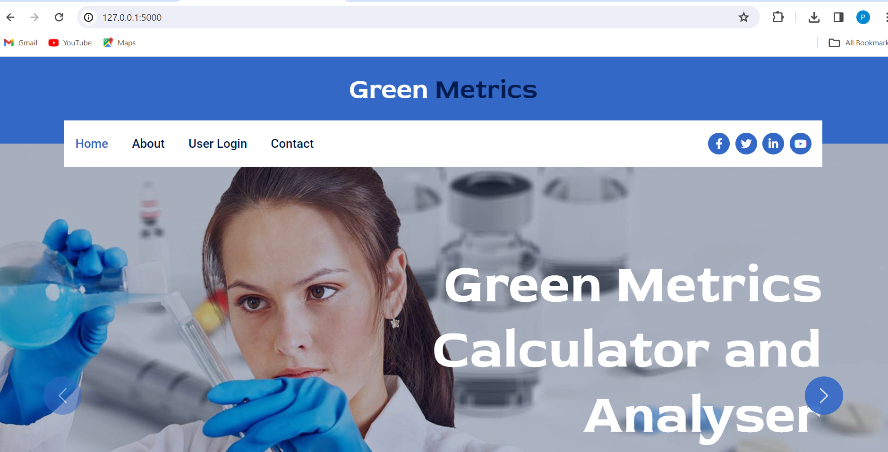

Login Page
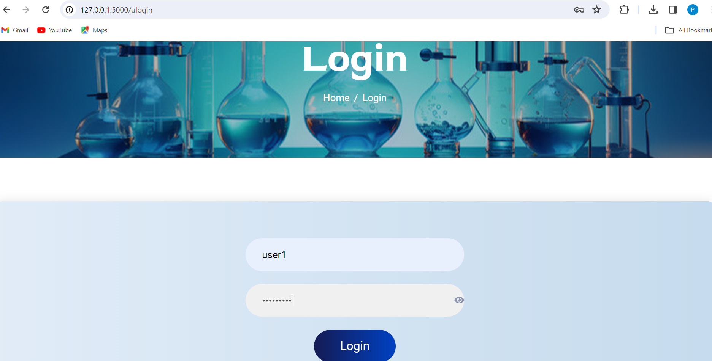

Sign Up Page
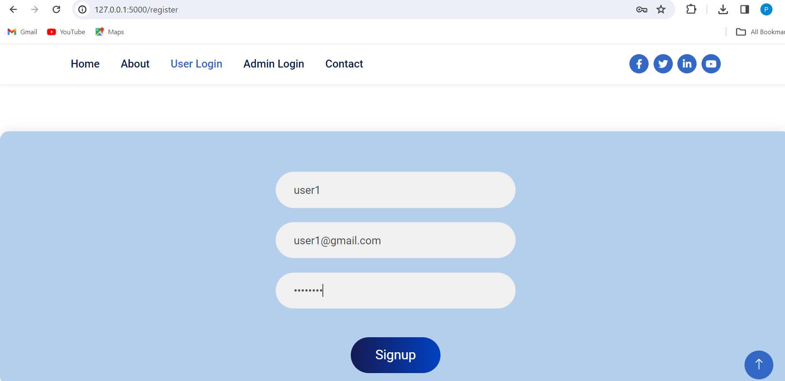

Input Form for Calculations
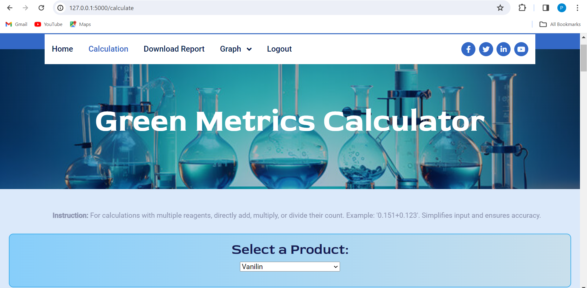
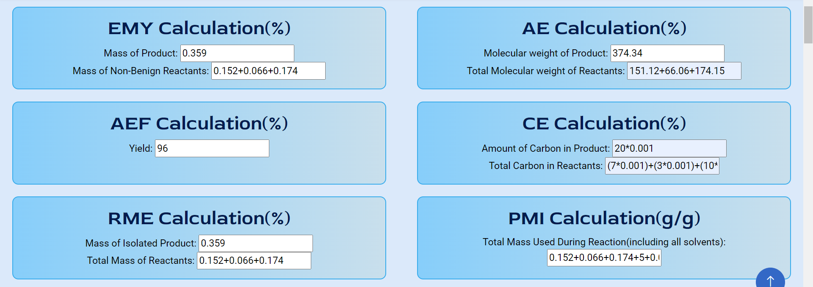

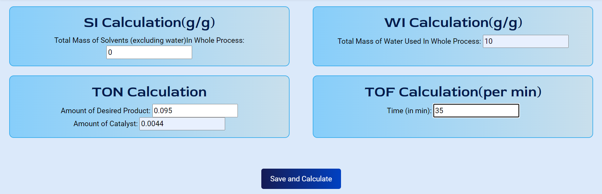

Green Metrics Output Table
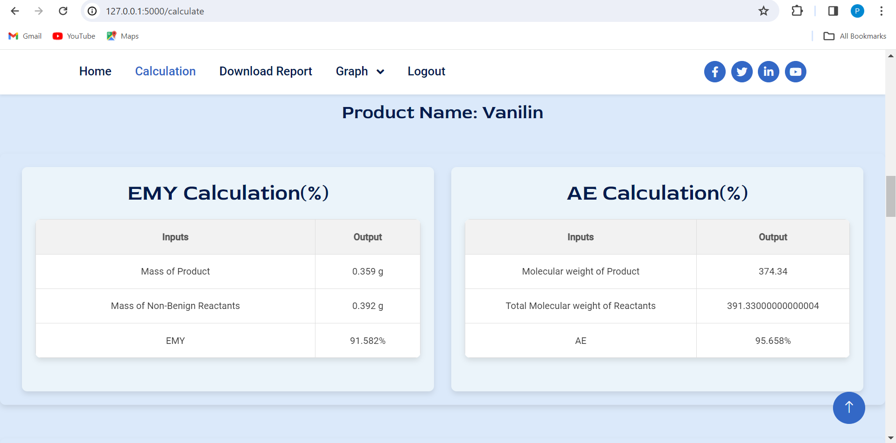
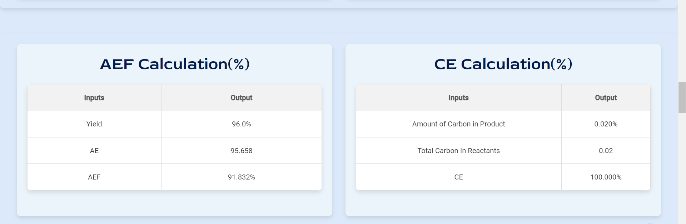
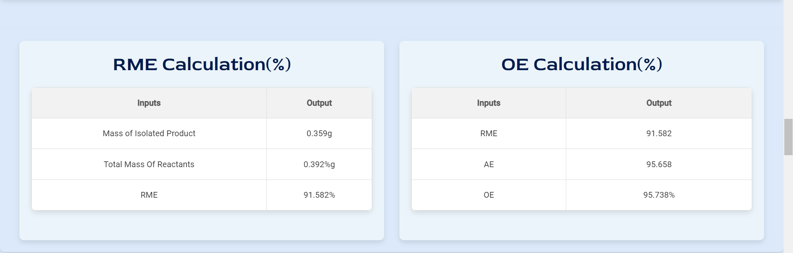
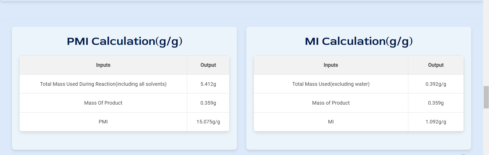
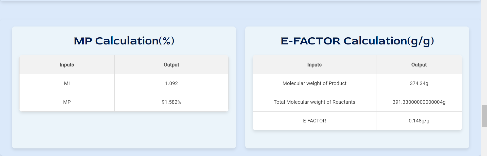
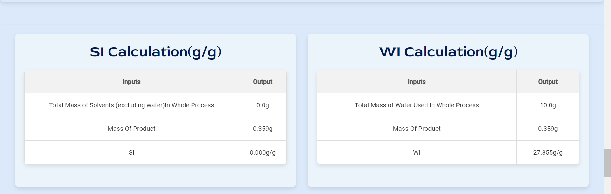
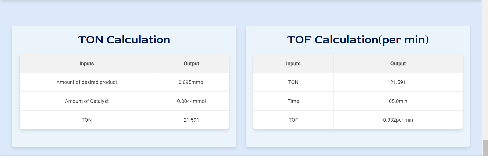

Report Generation Page
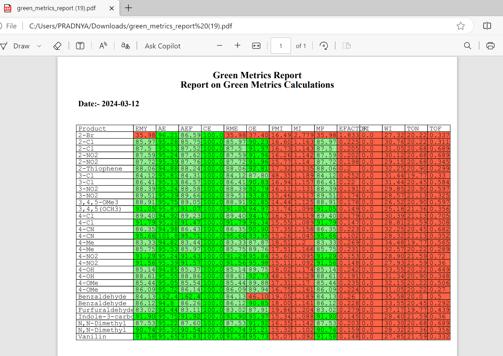
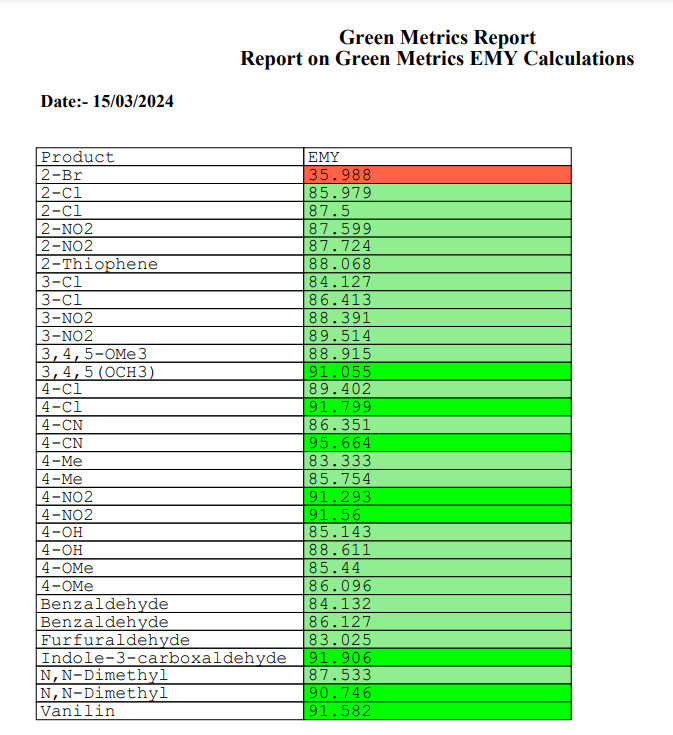

Graphical Analysis
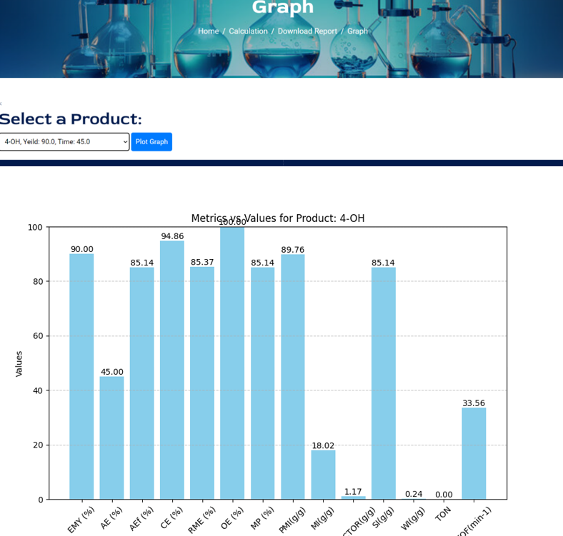
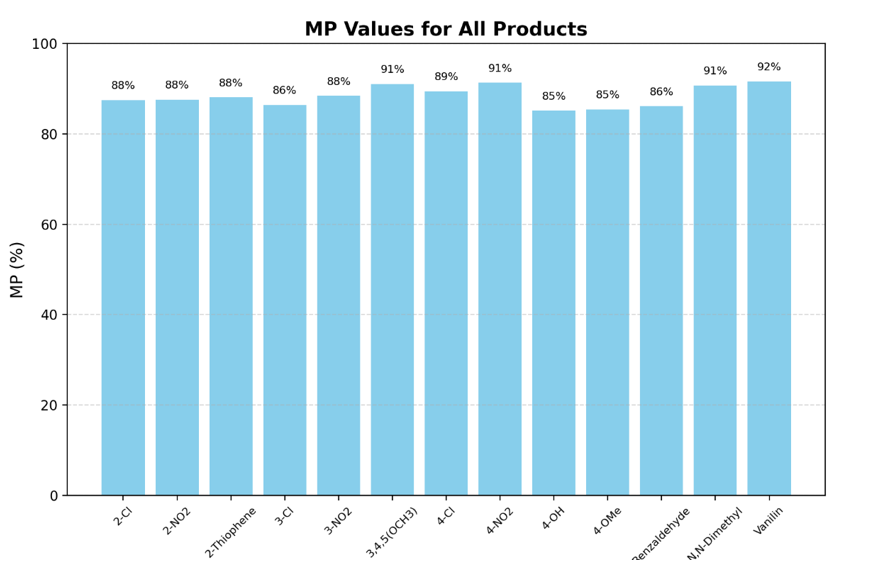

---

## 🙌 Acknowledgments

- Flask framework
- MySQL Server
- Python-dotenv
- Your interest in sustainable chemistry 🌱
